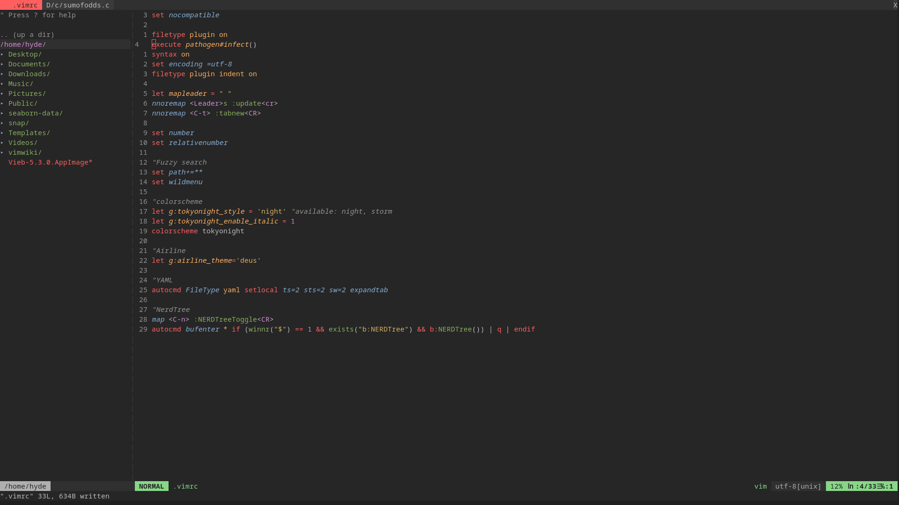

# vim-tokyo
This is my personal vim rice cocktail.
Plugin manager pathogen.

## Plugins

**Plugin Manager**:
[Pathogen.vim](https://github.com/tpope/vim-pathogen)

**Colorscheme**:
[tokyonight-vim](https://github.com/ghifarit53/tokyonight-vim)

**Essentials**:
[fugitive.vim](https://github.com/tpope/vim-fugitive)
[NERDTree](https://github.com/preservim/nerdtree)
[vim-airline](https://github.com/vim-airline/vim-airline)
[vim-airline-themes](https://github.com/vim-airline/vim-airline-themes)

## Screenshot

